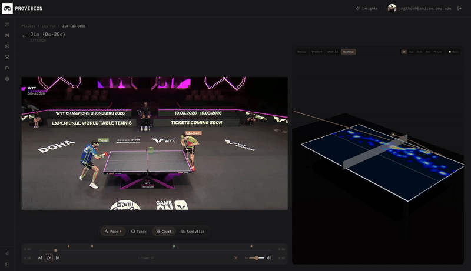

# PROVISION

Over 800 million people watch table tennis, but while football and basketball are drowning in analytics, table tennis coaches still spend hours scrubbing through video by hand. ProVision changes that by turning ordinary 2D match footage into live ball trajectories, 3D biomechanics, and Moneyball-grade analytics in minutes instead of hours.

  

  

    

## Features
- Heatmap visualization: Spatiotemporal shot-density maps overlaid on the table surface to reveal positional tendencies, high-probability zones, and directional bias for each player.
- Analytics: Match and stroke-level advanced metrics such as forehand/backhand splits, rally length distributions, power analysis on forehand vs backhand, shot quality scores) with longitudinal trend analysis across sessions
- Real-time ball tracking: Low-latency ball localization and trajectory estimation from monocular video using a CNN-based detection and tracking pipeline, enabling frame-accurate feedback during live or recorded play.
- Shot analysis: Deep analytics using SegFormer++ (Transformer-based semantic segmentation), WASB, and ViTPose for 3d reconstruction of game trajectory
- 3D biomechanics data: Reconstruction of player kinematics from 2D video, extracting join-level motion-features (speed, acceleration, and posture) to quantify technique efficiency
- Head-to-head advice: Player similarity modeling and matchup-specific recommendations driven by historical patterns in serve/receive behavior, shot selection, and positional tendencies

**ProVision Deck:** https://www.figma.com/deck/FdaBB10ebZ1kcceXqmSbSM

**Website:** https://tryprovision.vercel.app

**Video Demo:** [https://www.youtube.com/watch?v=XPG1tP3K3gs](https://youtu.be/pTD3uXY8vJo)

**Acknowledgements:**
- [TrackNet](https://github.com/yastrebksv/TrackNet)
- [UpliftingTableTennis](https://github.com/KieDani/UpliftingTableTennis)

Disclaimer: both repositories were minimally modified and inferenced on A100 SXM GPUs on Runpod
